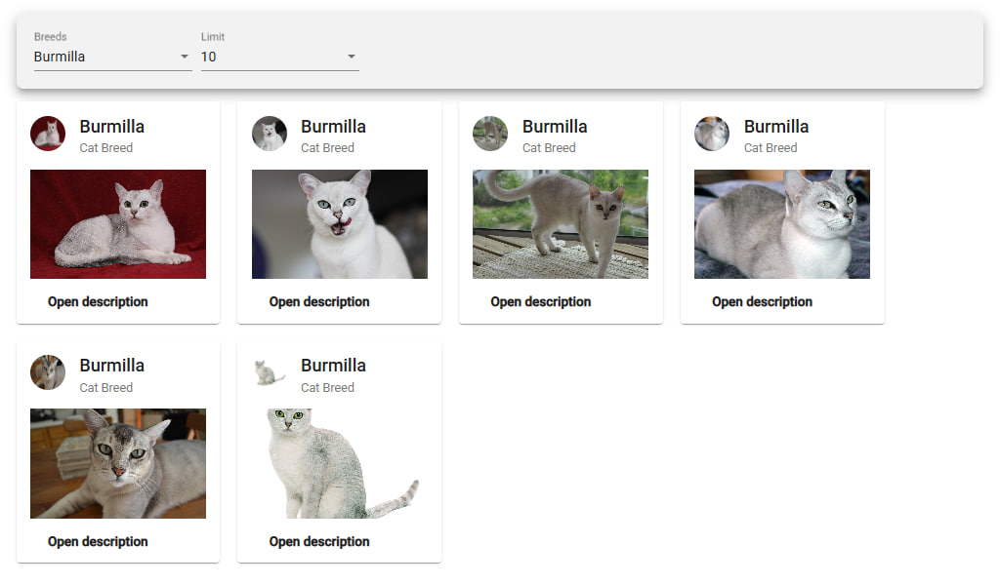

# Cat Breed Explorer

A small single-page application that lets you browse and explore different cat breeds. Built with modern web technologies, it fetches images and descriptions from a public API and displays them in a clean, responsive card layout.



## 🔍 Features

- **Breed Selection**  
  Choose any breed from a dropdown; the app will fetch and display sample images for that breed.
- **Result Limiting**  
  Control how many cards (images) to show at once with the “Limit” selector.
- **Responsive Cards**  
  Each breed card shows an avatar, title, subtitle, and “Open description” button for more details.
- **API-driven**  
  Uses the [TheCatAPI](https://api.thecatapi.com) to load up-to-date breed data and high-quality images.
- **Lightweight & Fast**  
  Minimal dependencies, quick image loading with lazy-fetching and simple caching.

## 📦 Tech Stack

- **Framework:** Angular
- **Styling:** Angular Material
- **HTTP:** HttpClient
- **API:** TheCatAPI
- **Bundler:** Angular CLI

## 🚀 Getting Started

1. **Clone the repo**
   ```bash
   git clone https://github.com/your-username/cat-breed-explorer.git
   cd cat-breed-explorer
   ```
